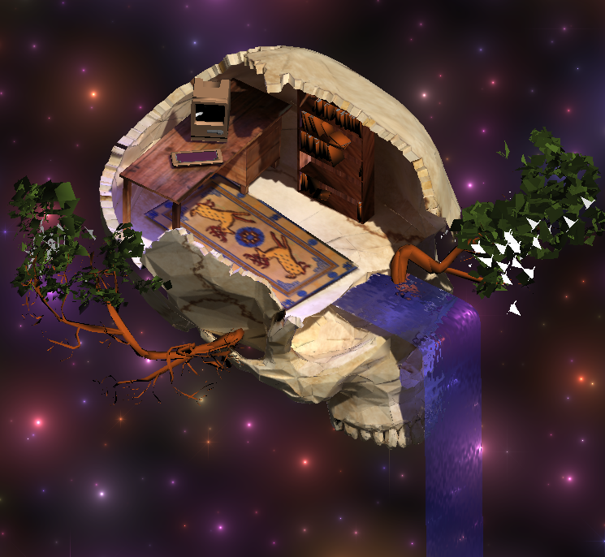
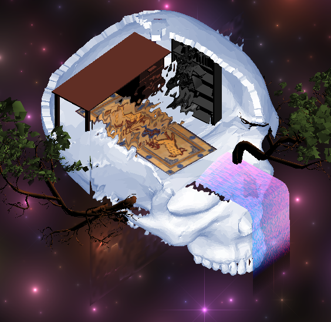

# A cool skull



A 3D demo showcasing post-processing effects, shaders, flocking boids, baked lighting, video as texture, and basic camera control.

# Getting started

install npm, npx. then run
```
npm install
npx vite
```
# Build

```npx vite build```


# Blender export

src/model/skull15.blend

open the skull blender file, and use the export tool to export a glb file. only export the uv's and points. you'll also want to delete the UVMap channel on the skull, rug and desk before exporting.

# Shimmering glass effect

docs/main_cool_stained_glass_effect.js has a cool stained glass effect. like this:

